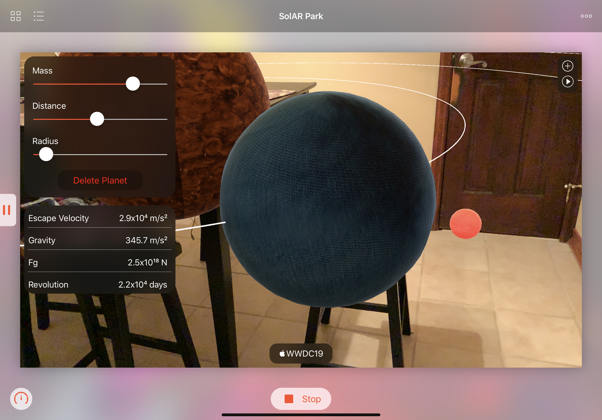
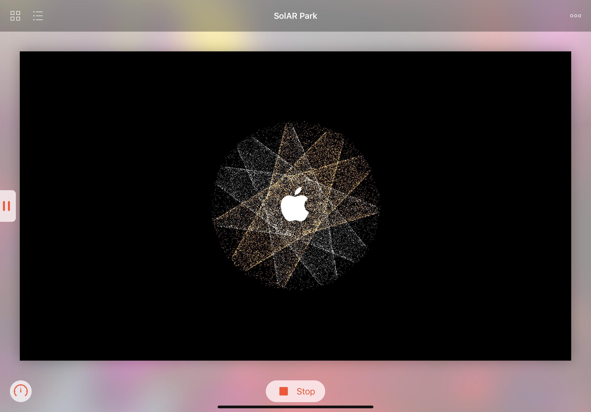
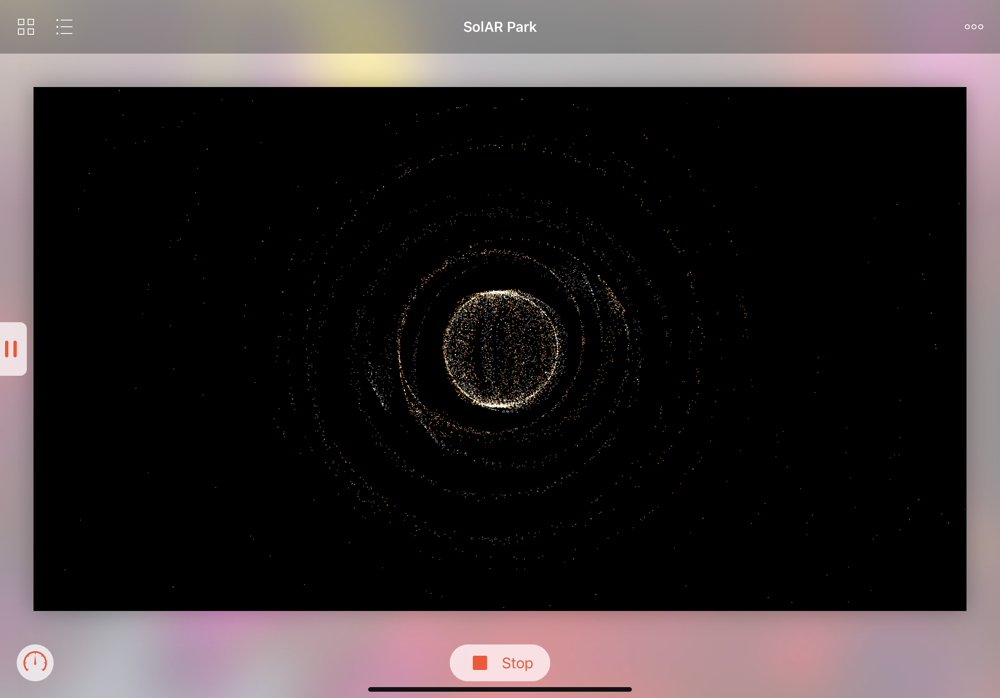

# SolAR Park WWDC19
A virtual Solar System in AR to learn about how planet distance, radius, and mass affects planetary motion. I use SceneKit for the introduction scene with particle systems, particle fields, and gravity, and SpriteKit for the 2D overlays. I also used UIKit for the blur views, sliders, and buttons as an overlay to a ARKit ARSCNView. 

My motivation for creating this playground came from difficulty in understanding physics concepts relating to planetary motion. This is because it is hard to visualize planets, which are giagantic and hard to scale. By using AR to place planets, they are able to create their own solar system that is to scale and see how each planetary variable effects its motion in real time. For instance, you can see how revolution period changes as distance increases. This is extremely useful for understanding abstract physics concepts with a simple user interace.

[View on YouTube]()

### Screenshots

